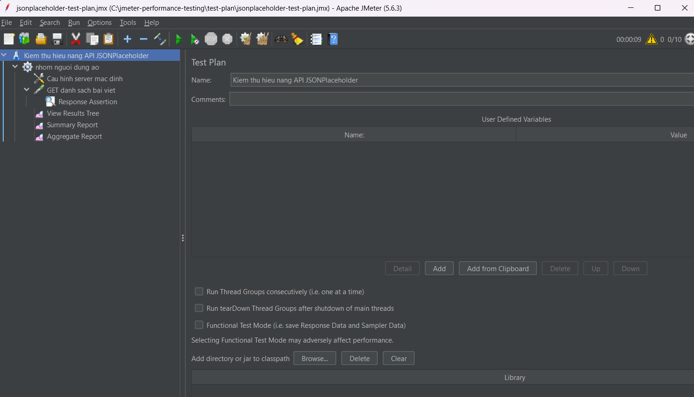
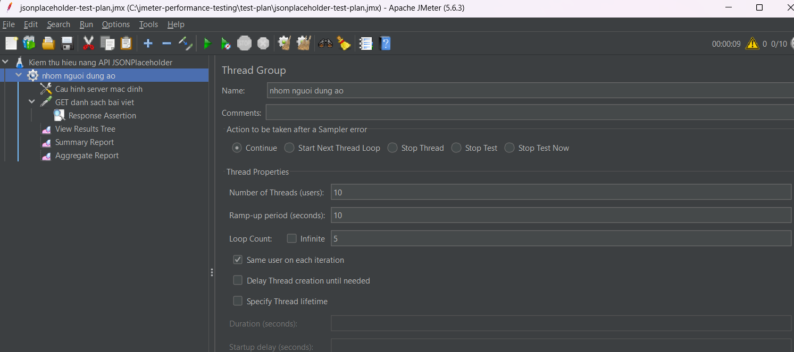
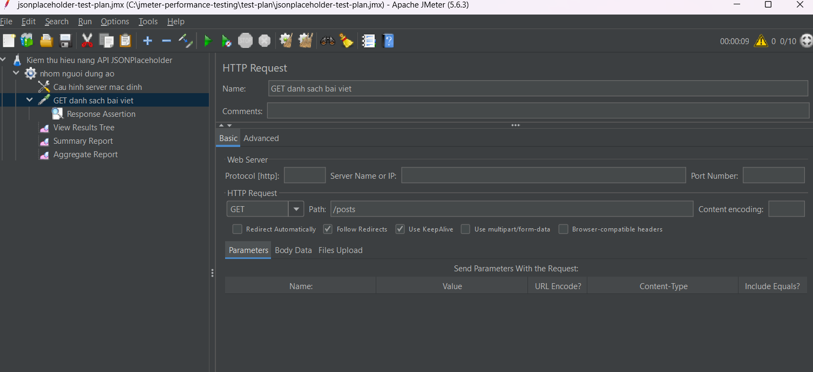
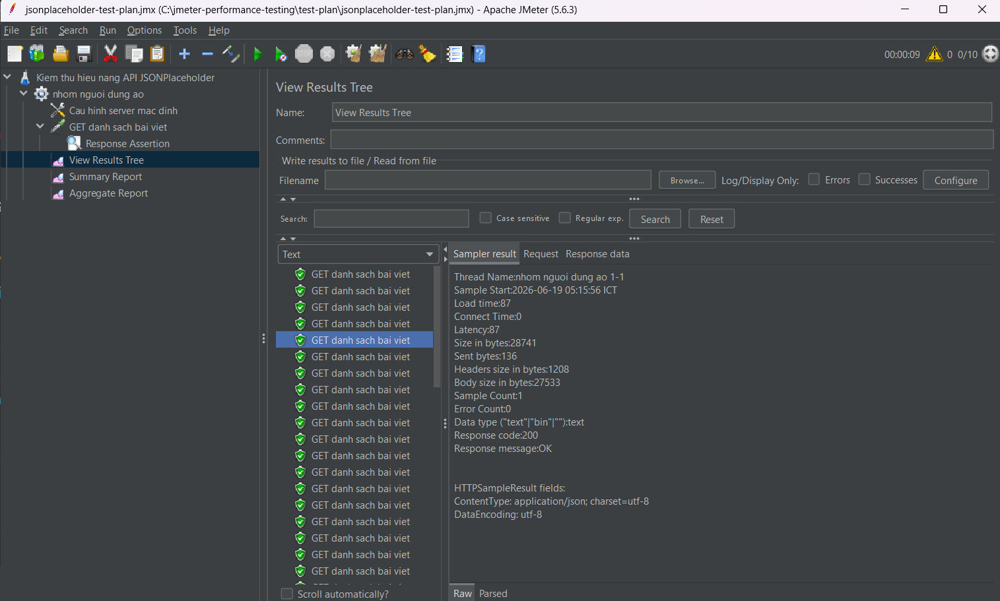
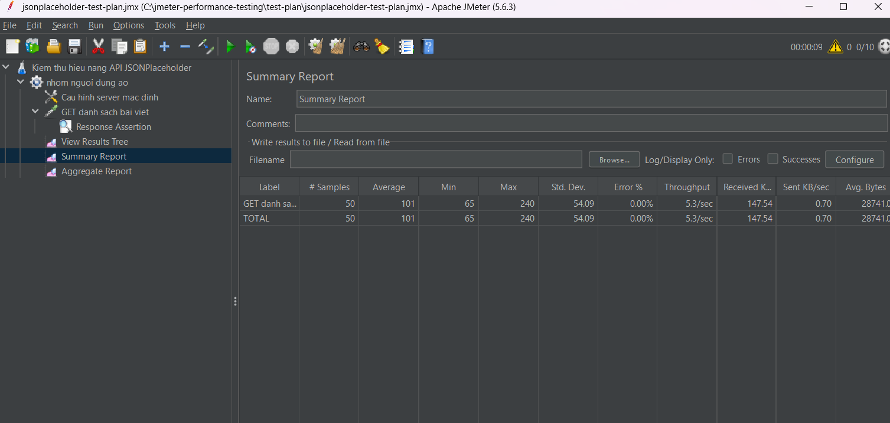
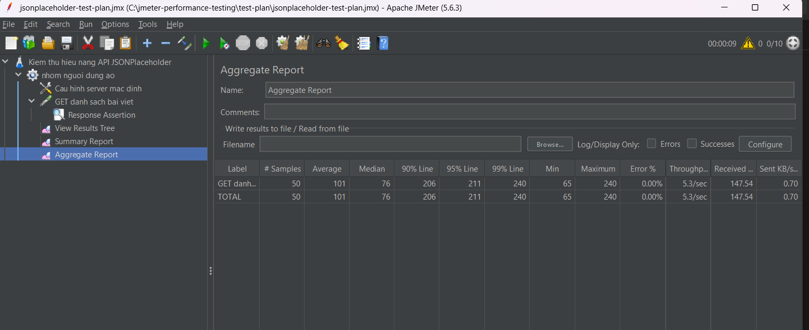

# Báo cáo thực hành kiểm thử hiệu năng với Apache JMeter

## 1. Giới thiệu

Bài thực hành này trình bày quá trình tìm hiểu và sử dụng công cụ **Apache JMeter** để kiểm thử hiệu năng của một API web.

Apache JMeter là công cụ hỗ trợ kiểm thử tải, kiểm thử hiệu năng và đo lường khả năng phản hồi của hệ thống khi có nhiều người dùng truy cập cùng lúc. Trong bài thực hành này, em sử dụng JMeter để gửi request đến API công khai **JSONPlaceholder**.

API được kiểm thử:

```text
https://jsonplaceholder.typicode.com/posts
```

JSONPlaceholder là API giả lập dữ liệu, thường được sử dụng trong học tập, thử nghiệm và kiểm thử các request HTTP.

---

## 2. Mục tiêu bài thực hành

Mục tiêu của bài thực hành gồm:

* Tìm hiểu công cụ kiểm thử hiệu năng Apache JMeter.
* Cài đặt và khởi chạy JMeter trên máy tính cá nhân.
* Tạo Test Plan kiểm thử API.
* Cấu hình số lượng người dùng ảo bằng Thread Group.
* Gửi request HTTP GET đến API.
* Sử dụng Response Assertion để kiểm tra mã phản hồi.
* Xem và phân tích kết quả kiểm thử bằng View Results Tree, Summary Report và Aggregate Report.
* Lưu sản phẩm và báo cáo lên GitHub Repository.

---

## 3. Công cụ và môi trường sử dụng

| Thành phần           | Nội dung            |
| -------------------- | ------------------- |
| Công cụ kiểm thử     | Apache JMeter 5.6.3 |
| Ngôn ngữ nền tảng    | Java / OpenJDK      |
| Phiên bản Java       | OpenJDK 11.0.23     |
| Hệ điều hành         | Windows             |
| Đối tượng kiểm thử   | JSONPlaceholder API |
| Phương thức kiểm thử | HTTP GET            |
| Nơi lưu sản phẩm     | GitHub Repository   |

---

## 4. Cấu trúc thư mục dự án

Cấu trúc thư mục của bài thực hành:

```text
jmeter-performance-testing/
│
├── README.md
├── test-plan/
│   └── jsonplaceholder-test-plan.jmx
│
└── images/
    ├── 01-test-plan.png.png
    ├── 02-thread-group.png.png
    ├── 03-http-request.png.png
    ├── 04-view-results-tree.png.png
    ├── 05-summary-report.png.png
    └── 06-aggregate-report.png.png
```

---

## 5. Kịch bản kiểm thử

Kịch bản kiểm thử được xây dựng nhằm mô phỏng nhiều người dùng gửi request đến API `/posts`.

| Thành phần             | Cấu hình                     |
| ---------------------- | ---------------------------- |
| Number of Threads      | 10 users                     |
| Ramp-up Period         | 10 seconds                   |
| Loop Count             | 5                            |
| HTTP Method            | GET                          |
| Protocol               | HTTPS                        |
| Server Name            | jsonplaceholder.typicode.com |
| Path                   | /posts                       |
| Expected Response Code | 200                          |

Tổng số request dự kiến:

```text
10 users × 5 loops = 50 requests
```

Ý nghĩa kịch bản: JMeter mô phỏng 10 người dùng ảo. Mỗi người dùng gửi request GET đến API `/posts` 5 lần. Kết quả được ghi nhận để đánh giá khả năng phản hồi của API.

---

## 6. Các bước thực hiện

### 6.1. Kiểm tra Java

Trước khi chạy JMeter, cần kiểm tra máy tính đã cài Java hay chưa bằng lệnh:

```bash
java -version
```

Kết quả máy đã cài OpenJDK 11.0.23, đáp ứng yêu cầu để chạy Apache JMeter.

---

### 6.2. Tạo Test Plan trong JMeter

Sau khi mở Apache JMeter, tạo một Test Plan mới với tên:

```text
Kiem thu hieu nang API JSONPlaceholder
```

Test Plan là thành phần chính dùng để chứa toàn bộ kịch bản kiểm thử, bao gồm Thread Group, HTTP Request, Assertion và các Listener để xem kết quả.

Ảnh minh họa Test Plan:



---

### 6.3. Cấu hình Thread Group

Thread Group được sử dụng để mô phỏng số lượng người dùng ảo truy cập vào hệ thống.

Cấu hình Thread Group:

```text
Number of Threads (users): 10
Ramp-up period (seconds): 10
Loop Count: 5
```

Trong đó:

* **Number of Threads**: số lượng người dùng ảo.
* **Ramp-up Period**: thời gian để khởi tạo toàn bộ người dùng ảo.
* **Loop Count**: số lần lặp lại request của mỗi người dùng.

Ảnh minh họa Thread Group:



---

### 6.4. Cấu hình HTTP Request

HTTP Request được sử dụng để gửi request GET đến API cần kiểm thử.

Cấu hình request:

```text
Method: GET
Path: /posts
```

Server được cấu hình trong HTTP Request Defaults:

```text
Protocol: https
Server Name or IP: jsonplaceholder.typicode.com
```

Request đầy đủ được gửi đến API:

```text
https://jsonplaceholder.typicode.com/posts
```

Ảnh minh họa HTTP Request:



---

### 6.5. Cấu hình Response Assertion

Response Assertion được sử dụng để kiểm tra kết quả phản hồi từ server.

Cấu hình Assertion:

```text
Field to Test: Response Code
Pattern: 200
```

Nếu API trả về mã phản hồi `200`, request được xem là thành công. Nếu mã phản hồi khác `200`, JMeter sẽ đánh dấu request là lỗi.

---

### 6.6. Thêm Listener để xem kết quả

Các Listener được sử dụng trong bài gồm:

| Listener          | Chức năng                             |
| ----------------- | ------------------------------------- |
| View Results Tree | Xem chi tiết từng request và response |
| Summary Report    | Xem kết quả tổng hợp                  |
| Aggregate Report  | Xem kết quả thống kê chi tiết         |

---

## 7. Kết quả kiểm thử trong View Results Tree

Sau khi chạy kiểm thử, các request gửi đến API đều trả về thành công.

Kết quả trong View Results Tree:

```text
Response code: 200
Response message: OK
Error Count: 0
```

Điều này cho thấy API đã phản hồi thành công với request GET `/posts`.

Ảnh minh họa View Results Tree:



---

## 8. Kết quả Summary Report

Summary Report hiển thị các thông số tổng hợp của quá trình kiểm thử.

Một số chỉ số quan trọng trong Summary Report:

| Chỉ số          | Ý nghĩa                                     |
| --------------- | ------------------------------------------- |
| # Samples       | Tổng số request đã gửi                      |
| Average         | Thời gian phản hồi trung bình               |
| Min             | Thời gian phản hồi nhỏ nhất                 |
| Max             | Thời gian phản hồi lớn nhất                 |
| Error %         | Tỷ lệ request lỗi                           |
| Throughput      | Số request xử lý trong một đơn vị thời gian |
| Received KB/sec | Dữ liệu nhận về mỗi giây                    |
| Sent KB/sec     | Dữ liệu gửi đi mỗi giây                     |

Ảnh minh họa Summary Report:



---

## 9. Kết quả Aggregate Report

Aggregate Report cung cấp kết quả thống kê chi tiết hơn so với Summary Report.

Một số chỉ số trong Aggregate Report:

| Chỉ số     | Ý nghĩa                                                         |
| ---------- | --------------------------------------------------------------- |
| Median     | Thời gian phản hồi trung vị                                     |
| 90% Line   | 90% request có thời gian phản hồi nhỏ hơn hoặc bằng giá trị này |
| 95% Line   | 95% request có thời gian phản hồi nhỏ hơn hoặc bằng giá trị này |
| 99% Line   | 99% request có thời gian phản hồi nhỏ hơn hoặc bằng giá trị này |
| Error %    | Tỷ lệ lỗi                                                       |
| Throughput | Khả năng xử lý request của API                                  |

Ảnh minh họa Aggregate Report:



---

## 10. Nhận xét kết quả

Dựa trên kết quả kiểm thử, API JSONPlaceholder phản hồi thành công với mã trạng thái HTTP `200`. Các request trong View Results Tree đều hiển thị màu xanh, cho thấy các request đã được xử lý thành công.

Tỷ lệ lỗi là `0%`, chứng tỏ toàn bộ request trong kịch bản kiểm thử đều được thực hiện thành công. Với số lượng người dùng ảo là 10 và mỗi người dùng gửi request 5 lần, API vẫn phản hồi ổn định trong phạm vi bài kiểm thử.

Các chỉ số trong Summary Report và Aggregate Report giúp đánh giá thời gian phản hồi trung bình, thời gian phản hồi nhỏ nhất, lớn nhất và throughput của API. Đây là các thông số quan trọng khi phân tích hiệu năng của một hệ thống web hoặc API.

---

## 11. Cách chạy lại bài kiểm thử

Có thể mở file `.jmx` bằng Apache JMeter và chạy trực tiếp bằng giao diện.

File Test Plan:

```text
test-plan/jsonplaceholder-test-plan.jmx
```

Ngoài ra, có thể chạy JMeter bằng command line:

```bash
jmeter -n -t test-plan/jsonplaceholder-test-plan.jmx -l results/result.jtl
```

Trong đó:

```text
-n: chạy JMeter ở chế độ non-GUI
-t: chỉ định file Test Plan .jmx
-l: lưu kết quả kiểm thử ra file .jtl
```

---

## 12. Kết luận

Qua bài thực hành này, em đã tìm hiểu và sử dụng được công cụ Apache JMeter để kiểm thử hiệu năng API. Bài thực hành đã hoàn thành các nội dung chính như cài đặt JMeter, tạo Test Plan, cấu hình Thread Group, gửi HTTP Request, kiểm tra Response Assertion và phân tích kết quả bằng các Listener.

Kết quả kiểm thử cho thấy API được kiểm thử phản hồi thành công, không phát sinh lỗi trong kịch bản đã xây dựng. JMeter là công cụ hữu ích trong việc kiểm thử tải, kiểm thử hiệu năng và đánh giá khả năng phản hồi của hệ thống.